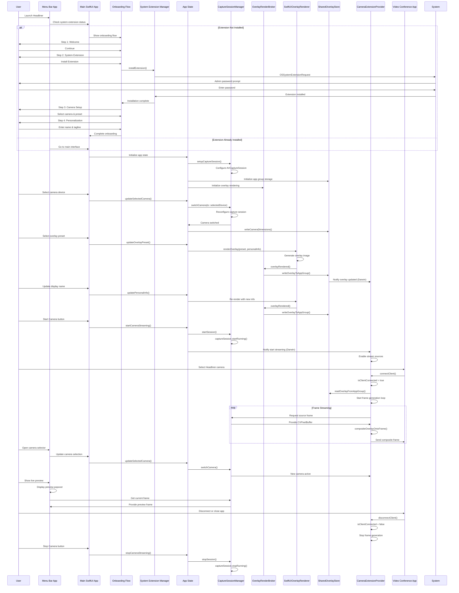
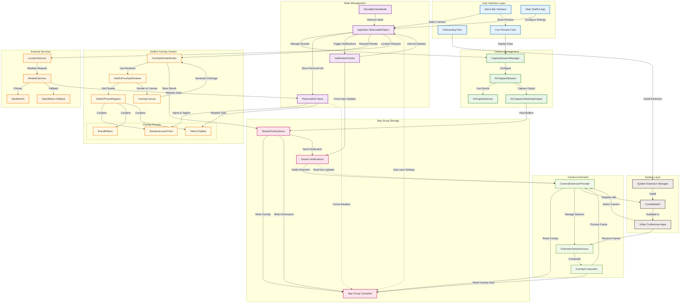
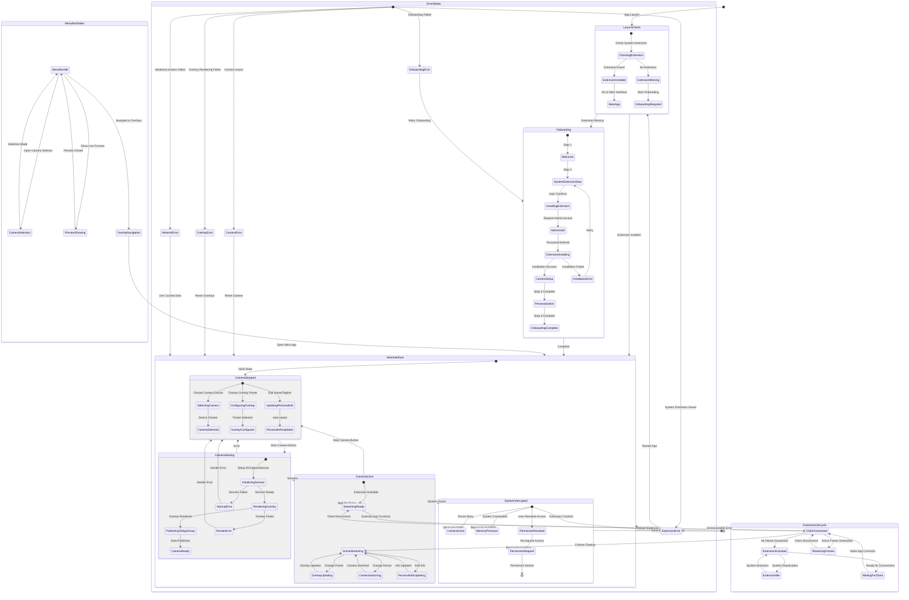
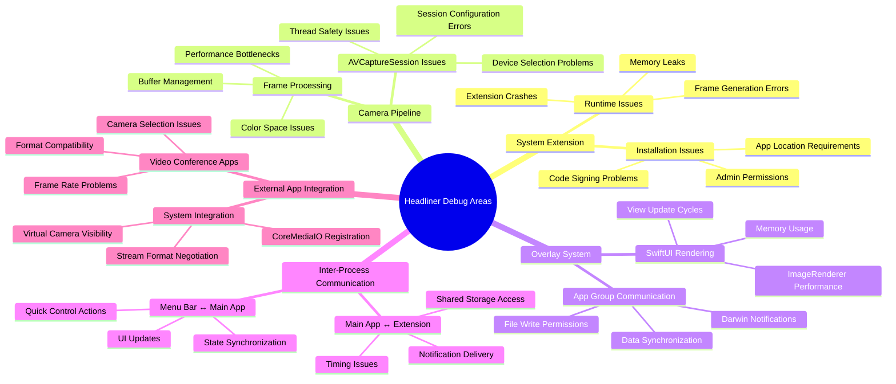

Camera Extension Flow
# Headliner CameraExtension - Comprehensive Mermaid Documentation

Based on your Headliner project architecture, here's the detailed visual documentation for debugging your custom CameraExtension implementation.

## 1. Class Diagram - Your Headliner CameraExtension Architecture

This diagram maps your specific implementation structure:

```mermaid
classDiagram
    %% Core Camera Extension Classes (Your Implementation)
    class CameraExtensionProvider {
        +sourceStream: ExtensionStreamSource
        +sinkStream: ExtensionStreamSource
        +isClientConnected: Bool
        +renderedOverlayImage: CGImage?
        +connectClient()
        +disconnectClient()
        +handleCustomProperty(key:value:)
        +sendFrameToSink()
    }

    class ExtensionStreamSource {
        +streamFormat: CMIOExtensionStreamFormat
        +isStreamingEnabled: Bool
        +currentPixelBuffer: CVPixelBuffer?
        +overlayCompositor: OverlayCompositor
        +generateCompositeFrame()
        +publishFrame()
    }

    class OverlayCompositor {
        +overlayRenderer: OverlayRenderer
        +sourceBuffer: CVPixelBuffer?
        +overlayImage: CGImage?
        +compositeOverlayOntoFrame()
        +scaleOverlayForBuffer()
    }

    %% Main App Components (SwiftUI)
    class AppState {
        +captureSessionManager: CaptureSessionManager
        +selectedCamera: CameraDevice?
        +selectedPreset: OverlayPreset
        +isStreamingActive: Bool
        +personalInfo: PersonalInfo
        +notifyExtension()
    }

    class MainAppView {
        +appState: AppState
        +previewRenderer: CameraPreviewCard
        +cameraSelector: LoomStyleSelector
        +overlaySelector: LoomStyleSelector
        +toggleCamera()
        +changePreset()
    }

    class MenuBarViewModel {
        +appState: AppState
        +menuContent: MenuContent
        +isPreviewPopoverShown: Bool
        +cameraDevices: [CameraDevice]
        +showPreviewPopover()
        +handleCameraSelection()
    }

    class OnboardingView {
        +currentStep: OnboardingStep
        +systemExtensionManager: SystemExtensionManager
        +progressToNextStep()
        +installExtension()
    }

    %% Shared Components (HeadlinerShared)
    class CaptureSessionManager {
        +captureSession: AVCaptureSession
        +currentDevice: AVCaptureDevice?
        +videoOutput: AVCaptureVideoDataOutput
        +previewLayer: AVCaptureVideoPreviewLayer?
        +startSession()
        +stopSession()
        +switchCamera(to:)
        +configureCameraForStreaming()
    }

    class SharedOverlayStore {
        +containerURL: URL
        +overlayImageData: Data?
        +cameraPixelBufferSize: CGSize
        +writeOverlayToAppGroup()
        +readOverlayFromAppGroup()
        +writeCameraDimensions()
    }

    class PersonalInfoModels {
        +displayName: String
        +tagline: String?
        +locationInfo: LocationInfo?
        +weatherInfo: WeatherInfo?
    }

    class OverlayModels {
        +overlayPresets: [OverlayPreset]
        +themeSystem: ThemeSystem
        +safeAreaMode: SafeAreaMode
    }

    %% SwiftUI Overlay System (Main App Only)  
    class SwiftUIPresetRegistry {
        +registeredPresets: [String: OverlayPreset]
        +getPreset(identifier:)
        +registerPreset(_:)
    }

    class SwiftUIOverlayRenderer {
        +imageRenderer: ImageRenderer
        +overlayCanvas: OverlayCanvas
        +renderOverlayToImage()
        +scaleForCameraDimensions()
    }

    class OverlayRenderBroker {
        +sharedStore: SharedOverlayStore
        +renderer: SwiftUIOverlayRenderer
        +publishRenderedOverlay()
        +handleDimensionUpdates()
    }

    class StandardLowerThird {
        +personalInfo: PersonalInfo
        +theme: Theme
        +body: some View
    }

    class BrandRibbon {
        +personalInfo: PersonalInfo  
        +theme: Theme
        +body: some View
    }

    class MetricChipBar {
        +personalInfo: PersonalInfo
        +weatherInfo: WeatherInfo?
        +theme: Theme
        +body: some View
    }

    %% UI Components
    class LoomStyleSelector {
        +options: [SelectableOption]
        +selectedValue: Binding
        +style: SelectorStyle
        +onSelectionChanged: (Any) -> Void
    }

    class MenuBarCameraSelector {
        +availableDevices: [CameraDevice]
        +selectedDevice: Binding
        +deviceStatusBadges: [DeviceStatus]
        +showDeviceDetails()
    }

    class CameraPreviewCard {
        +captureSession: AVCaptureSession
        +overlayPreview: AnyView?
        +isRenderingOverlay: Bool
        +renderLivePreview()
    }

    %% Services and Managers
    class LocationService {
        +locationManager: CLLocationManager
        +currentLocation: CLLocation?
        +cityName: String?
        +requestLocationPermission()
        +getCurrentCity()
    }

    class WeatherService {
        +weatherKit: WeatherService
        +openMeteoFallback: OpenMeteoService
        +currentWeather: WeatherInfo?
        +fetchWeatherData()
        +fallbackToOpenMeteo()
    }

    class SystemExtensionManager {
        +extensionIdentifier: String
        +activationRequest: OSSystemExtensionRequest?
        +installationState: ExtensionState
        +installExtension()
        +handleActivationResult()
    }

    %% Notification System
    class NotificationCenter {
        +internalNotifications: InternalNotificationCenter
        +crossAppNotifications: CrossAppNotificationCenter
        +sendCameraUpdate()
        +sendOverlayUpdate()
    }

    class CrossAppNotificationCenter {
        +darwinNotificationCenter: CFNotificationCenter
        +appGroupIdentifier: String
        +postOverlayUpdate()
        +observeExtensionMessages()
    }

    %% Relationships - Extension Architecture
    CameraExtensionProvider ||--o{ ExtensionStreamSource : manages
    ExtensionStreamSource ||--|| OverlayCompositor : uses
    OverlayCompositor --|> SharedOverlayStore : reads from

    %% Main App Architecture
    AppState ||--|| CaptureSessionManager : manages
    AppState ||--|| SharedOverlayStore : writes to
    AppState ||--|| PersonalInfoModels : contains
    
    MainAppView ||--|| AppState : observes
    MainAppView ||--|| LoomStyleSelector : contains
    MainAppView ||--|| CameraPreviewCard : contains
    
    MenuBarViewModel ||--|| AppState : observes
    MenuBarViewModel ||--|| MenuBarCameraSelector : manages
    
    OnboardingView ||--|| SystemExtensionManager : uses

    %% Overlay System Relationships
    SwiftUIPresetRegistry ||--o{ StandardLowerThird : contains
    SwiftUIPresetRegistry ||--o{ BrandRibbon : contains  
    SwiftUIPresetRegistry ||--o{ MetricChipBar : contains
    
    SwiftUIOverlayRenderer ||--|| SwiftUIPresetRegistry : uses
    OverlayRenderBroker ||--|| SwiftUIOverlayRenderer : manages
    OverlayRenderBroker ||--|| SharedOverlayStore : writes to

    %% Service Dependencies
    AppState ||--|| LocationService : uses
    AppState ||--|| WeatherService : uses
    AppState ||--|| NotificationCenter : uses
    
    NotificationCenter ||--|| CrossAppNotificationCenter : contains
    CrossAppNotificationCenter -.-> CameraExtensionProvider : notifies

    %% Shared Data Flow
    SharedOverlayStore -.-> ExtensionStreamSource : provides overlays
    CaptureSessionManager -.-> SharedOverlayStore : provides dimensions
```

## 2. Sequence Diagram - Complete Headliner Workflow

This shows your specific app flow from launch through streaming:



## 3. Component Data Flow - Your Headliner Architecture

This diagram shows how data flows through your specific implementation:



## 4. State Diagram - Your Headliner App States

This shows the specific states your Headliner app can be in:



## 5. Debugging Focus Areas

Based on your implementation, here are the key debugging areas with their relationships:



## Key Implementation Notes for Debugging

### Critical Debug Points:
1. **System Extension Installation**: Check logs with `subsystem:com.dannyfrancken.headliner category:Extension`
2. **Frame Generation**: Monitor `category:CaptureSession` for pipeline issues
3. **App Group Communication**: Watch `category:notifications.crossapp` for IPC problems
4. **Overlay Rendering**: Track SwiftUI rendering performance and memory usage
5. **External App Integration**: Test with multiple video apps for compatibility

### Common Issues to Watch:
- **Threading**: Ensure AVCaptureSession operations stay on the session queue
- **Memory Management**: Watch for retain cycles in the extension
- **File Permissions**: Verify App Group container access rights
- **Timing**: Handle async operations between app and extension properly
- **Error Recovery**: Implement robust error handling for system interruptions
