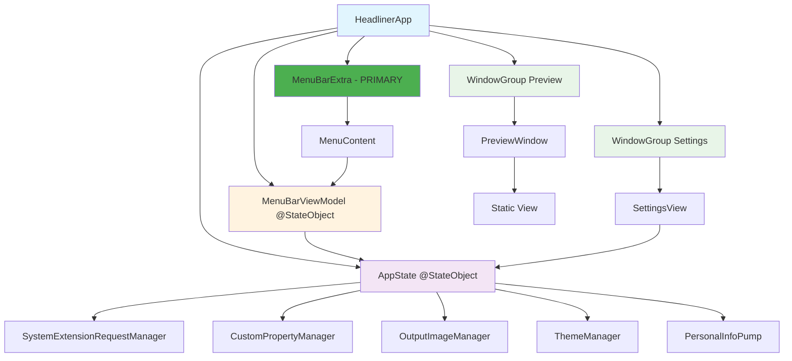

# Menu App Architecture

## Overview

This document describes the architecture of the Headliner menu bar app implementation. The menu bar interface IS the primary app - no more separate main window. Clean, simple, and performant.

## Architecture Diagram



## Key Components

### HeadlinerApp (Main App)

- **Role**: Application entry point and scene coordinator
- **Scenes**:
  - MenuBarExtra (primary interface)
  - WindowGroup for Settings
  - WindowGroup for Preview
  - WindowGroup for Main app (legacy support)

### AppState (Singleton)

- **Role**: Central state management and coordination
- **Key Features**:
  - Singleton pattern for consistent state across scenes
  - Manages system extension lifecycle
  - Handles camera management and overlay settings
  - Coordinates with camera extension via Darwin notifications

### MenuBarViewModel

- **Role**: Menu-specific state and actions
- **Key Features**:
  - Wraps AppState for menu bar interface
  - Provides menu-specific computed properties
  - Handles launch-at-login functionality
  - Manages window state for Settings and Preview

## Architectural Improvements Made

### 1. Removed AppManager Anti-pattern

**Before**: Complex nested dependency injection

```swift
@StateObject private var appManager = AppManager()
// AppManager contained AppState + dependencies
```

**After**: Direct singleton usage following Apple patterns

```swift
@StateObject private var appState = AppState.shared
@StateObject private var menuBarViewModel = MenuBarViewModel(appState: AppState.shared)
```

### 2. Simplified Dependency Management

- AppState is now a singleton with internal dependency management
- No wrapper classes or complex initialization chains
- Clean separation between app state and UI state

### 3. Clear Scene Boundaries

Each scene has clear responsibilities:

- **MenuBarExtra**: Primary user interface
- **Settings Window**: Configuration interface
- **Preview Window**: Camera preview
- **Main Window**: Legacy full app interface

## Communication Patterns

### App ↔ Extension

- **Darwin Notifications**: One-way fire-and-forget messages
- **App Group UserDefaults**: Shared settings storage
- **Notification Events**:
  - `com.headliner.start` - Start virtual camera
  - `com.headliner.stop` - Stop virtual camera
  - `com.headliner.setCamera` - Change input camera
  - `com.headliner.setOverlay` - Update overlay settings

### UI State Flow

1. User interacts with MenuContent
2. MenuBarViewModel processes action
3. AppState updates internal state
4. AppState notifies extension via Darwin notifications
5. AppState persists changes to App Group UserDefaults
6. UI updates via @Published properties

## Menu Bar Interface Design

### Modern Overlay Selector

- Visual category indicators with color coding
- Hover states and selection feedback
- Quick enable/disable toggle
- Filtered overlay options for common use cases

### Apple HIG Compliance

- Native macOS menu styling
- Proper keyboard navigation
- Accessibility labels and hints
- Dark mode support

## Best Practices Followed

1. **Single Source of Truth**: AppState singleton
2. **Separation of Concerns**: Clear boundaries between components
3. **Apple Design Patterns**: Proper @StateObject usage
4. **Performance**: Lazy initialization and efficient updates
5. **Maintainability**: Simple dependency injection

## Future Considerations

- **XPC Services**: For bi-directional extension communication
- **Global Shortcuts**: Keyboard shortcuts for common actions
- **Health Monitoring**: Extension status and performance tracking
- **Analytics**: Usage patterns and error reporting
